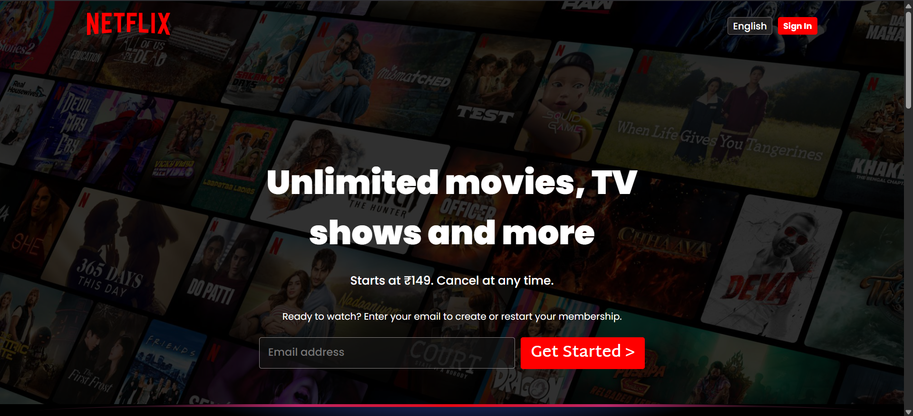
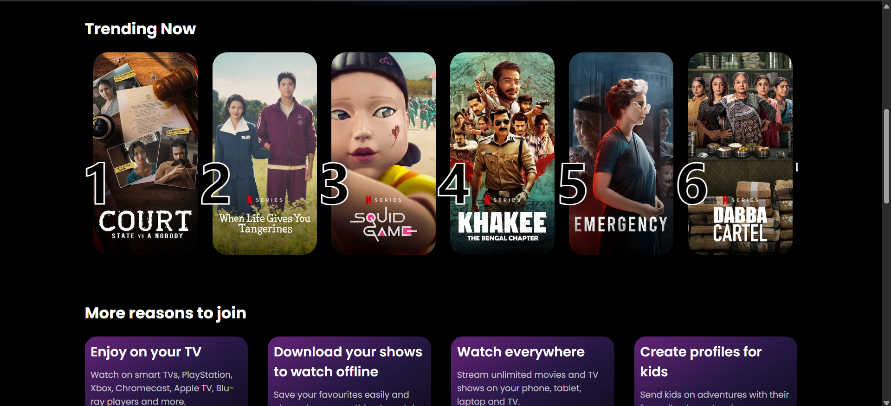
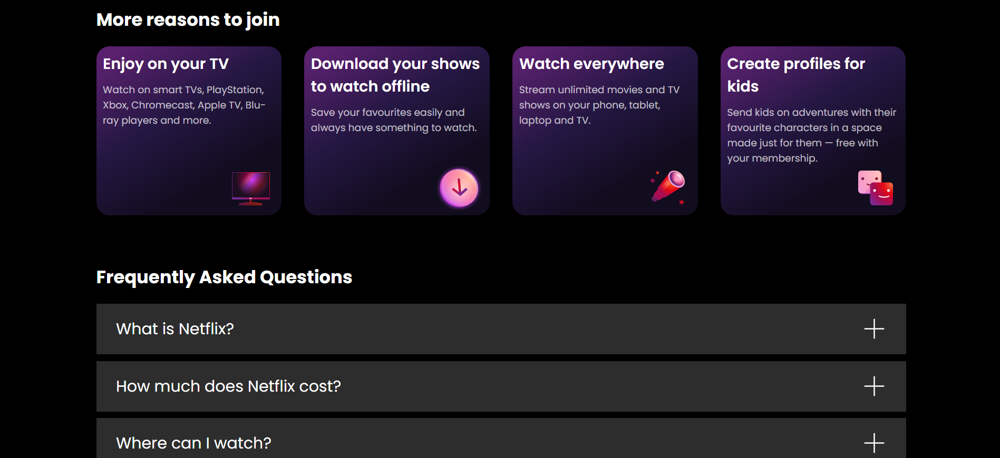

# 🎬 Netflix Clone (Responsive UI)

A fully responsive **Netflix homepage clone** built using **HTML5** and **CSS3**, closely mimicking the layout and design of the real Netflix web interface. This project focuses on clean UI, responsive design, and frontend development best practices.

## 📸 Demo

[🔗 Live Demo](Assets/Videos/LiveDemo.mp4)

---

## 🚀 Features

- 📱 **Fully Responsive Design** – Optimized for desktop, tablet, and mobile screens
- 🧱 **HTML5 Semantic Structure** – Clean and accessible markup
- 🎨 **Modern CSS Styling** – Custom styles using Flexbox and Grid
- 🎥 **Netflix-style UI** – Hero banner, navigation bar, thumbnails, footer & more
- ✨ **Hover Effects & Transitions** – Smooth interactions across elements
- 🌐 **Cross-Browser Compatible**

---

## 🛠️ Built With

- HTML5
- CSS3 (Flexbox & Grid)
- Google Fonts (Imported from)
- Font Poppins, Martel Sans (Imported)

---
